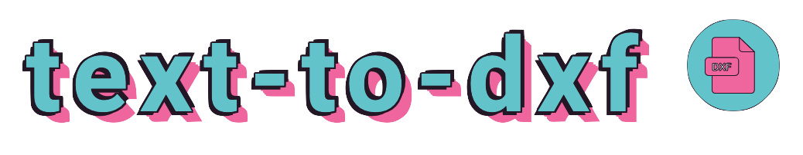

> Create a .dxf file containing the provided text

Available at https://text-to-dxf.cluster.fun/

## Features

Runs a webserver that takes in an `?text=` query string and then returns it as a .dxf.

Optionally a `?font=` can be provided, current available fonts are:

* Roboto
* Fira Sans
* Lobster
* Pacifico
* Permanent Marker
* Ceviche One
* Londrina Shadow
* Press Start 2P
* UnifrakturMaguntia
* Zilla Slab Highlight

## Usage

```sh
docker run -it --rm -p 8080:8080 docker.cluster.fun/averagemarcus/text-to-dxf
```

## Building from source

With Docker:

```sh
make docker-build
```

## Resources

* [inkscape](https://inkscape.org/)

## Contributing

If you find a bug or have an idea for a new feature please raise an issue to discuss it.

Pull requests are welcomed but please try and follow similar code style as the rest of the project and ensure all tests and code checkers are passing.

Thank you 💛

## License

See [LICENSE](LICENSE)
